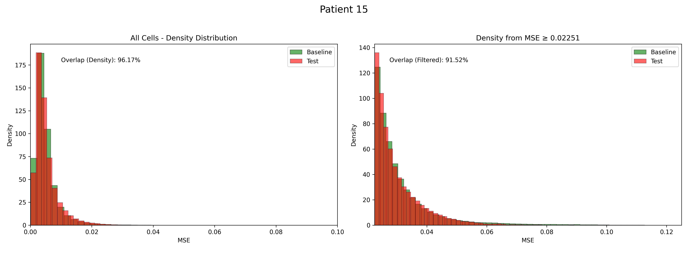
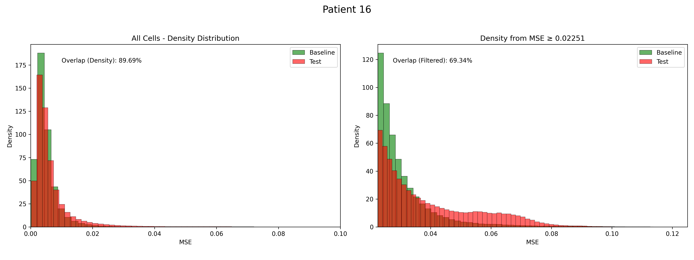

# 📊 Plots and Their Interpretations

---

## Left Plot → **All Cells - Density Distribution**

**Purpose:**  
To compare how similar the patient’s MSE (Mean Squared Error) distribution is to the healthy (baseline) distribution for **all cells**.

- **X-axis:** MSE — Reconstruction error per cell. Higher values may indicate abnormal cells.
- **Y-axis:** Density — Normalized frequency (not raw count). The area under the curve sums to 1.
- **Green bars:** Healthy baseline — Distribution of MSE values from healthy patients (Patient 1 to 6).
- **Red/Yellow bars:** Current patient — Distribution of MSE values for the target patient.  
  - **Red:** Test patients (potential MRD)  
  - **Yellow:** Healthy patients
- **Overlap (Density):** Measures how much the patient's distribution aligns with the healthy distribution.  
  - Higher % → More similarity  
  - Lower % → More deviations from normal

---

## Right Plot → **High Error Cells (MSE > Threshold)**

**Purpose:**  
To compare how similar the patient’s MSE distribution is to the healthy baseline **only for cells with high reconstruction error** (i.e., cells where MSE ≥ threshold).

- **X-axis:** MSE > threshold — Only those cells with high reconstruction error.
- **Y-axis:** Density — Normalized frequency (area under the curve = 1).
- **Green bars:** Distribution of high-MSE cells from healthy baseline (typically sparse).
- **Red/Yellow bars:** Distribution of high-MSE cells from the current patient.
- **Overlap (Filtered):** Measures how similar the high-error region is between the patient and healthy reference.

---

## Example Interpretations

| Patient ID | MRD Percentage | Interpretation |
|------------|----------------|----------------|
| **15** | **1.02%** | Patient 15 shows strong similarity to healthy profiles.    **Left Plot:** A high overlap of **96.17%**, indicating that the reconstruction error distribution across all cells closely matches healthy patients.  **Right Plot:** Even among high-error cells (MSE ≥ 0.02251), the overlap remains high at **91.52%**.   *Interpretation:* These "anomalous" cells behave similarly to rare high-error cells naturally seen in healthy individuals. |
| **16** | **4.35%** | Patient 16 shows moderate deviation.   **Left Plot:** High overall similarity with **89.69%** overlap, suggesting most cells are normal.   **Right Plot:** The overlap drops to **69.36%**, and the red bars extend further to the right, indicating the presence of distinctly anomalous cells.   *Interpretation:* Suggestive of Minimal Residual Disease (MRD) or abnormal activity not seen in healthy individuals. |

---

   

   

