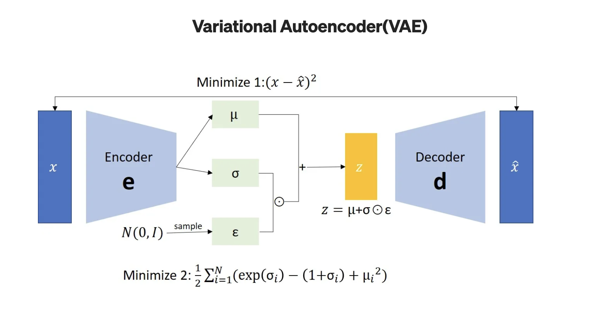

# Variational Autoencoder (VAE) for Anomaly Detection in Flow Cytometry

This module implements a Variational Autoencoder (VAE)-based deep learning approach to detect Minimal Residual Disease (MRD) in flow cytometry data.

---

## Purpose

A VAE is a generative model that learns a smooth and regularized latent representation of high-dimensional data. Instead of encoding input data to a single point, it maps each input to a probability distribution in latent space. It enables better generalization, sampling, and anomaly detection.

In our case:

- The **encoder** maps each cell (14-dimensional feature vector) to a latent distribution `N(mu(x), sigma^2(x))`
- A **latent vector z** is sampled using the reparameterization trick: `z = mu + sigma * epsilon`, where `epsilon ~ N(0,1)`
- The **decoder** reconstructs the input from this `z` , ideally producing  `x_hat ≈ x`
- After training, **cells with high reconstruction error (MSE)** are considered **anomalous**.

---

  

---

## Approach

### 1. Architecture

- Input dimension: 14 (cell features)
- Encoder: Linear layers (14 → 16 → 8 → 4)
- Latent dimension: Tried **2** and **4**
- Decoder: Linear layers (latent → 4 → 8 → 16 → 14)
- Activation: ELU

### 2. Loss Function

- **Reconstruction Loss**: Mean Squared Error (MSE)
- **KL Divergence**: Encourages the latent distribution `q(z|x)` to stay close to `N(0,1)`
- **Total VAE Loss**:  
   `L_vae = L_reconstruction + beta * L_KL`
- Tried `beta` : **1, 0.01, 0.02, 0.004, 0.005**  
  - Final: **beta = 0.005** for best balance of reconstruction & regularization

### 3. Training Details

- Healthy patients only (P1–P6)
- Scaled data using **MinMaxScaler**
- Batch size: 256
- Epochs: 100
- Optimizer: Adam
- Early stopping: Patience = 15

### 4. Validation Strategy

- **Leave-One-Patient-Out (LOPO)** cross-validation
- In each fold:
  - Leave one healthy patient out
  - Train on remaining 5
  - Validate on the held-out one
- Each fold **resumes training from the previous saved model**, enabling **progressive fine-tuning**

### 5. Inference and MRD Estimation

- For each test patient (P7–P12):
  - Encode → Sample z → Decode → Compute MSE
  - If MSE > threshold → **Anomalous cell**

---

## 📈 Results

Final model:  
- Latent dimension = 4  
- `beta = 0.005`
- LOPO training with progressive fine-tuning

**Performance Metrics:**

- **MSE**: 0.1579  
- **MAE**: 0.3567

**Predicted vs Actual MRD (%):**

| Patient | Predicted MRD (%) | Actual MRD (%) |
|---------|--------------------|----------------|
| P7      | 3.70               | 3.28           |
| P8      | 1.30               | 1.20           |
| P9      | 9.44               | 9.30           |
| P10     | 2.75               | 2.17           |
| P11     | 14.15              | 14.60          |
| P12     | 3.75               | 4.20           |

---

## 📊 Visualization

We used:

- **Bar charts** for comparing actual vs predicted MRD
- **Line charts** for trend analysis across patients

---

## Dependencies

- `torch`
- `numpy`, `pandas`
- `matplotlib`, `seaborn`
- `scikit-learn`
- `joblib`

---

## References

- [PyTorch VAE Tutorial](https://pytorch.org/tutorials/beginner/vae.html)
- [Uncovering Anomalies with Variational Autoencoders – Towards Data Science](https://towardsdatascience.com/uncovering-anomalies-with-variational-autoencoders-vae-a-deep-dive-into-the-world-of-1b2bce47e2e9/)
- [Hands-On Anomaly Detection with Variational Autoencoders – Medium](https://medium.com/data-science/hands-on-anomaly-detection-with-variational-autoencoders-d4044672acd5)

---
